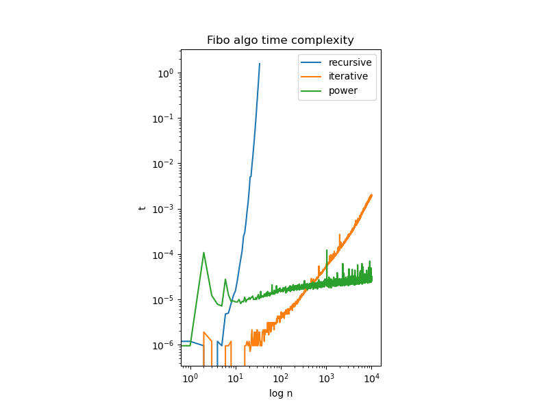

# Answers

Put any answers to questions in the assignment in this file, or any commentary you don't include in the code.

This is a markdown file (the `.md` extension gives it away). If you have never used markdown before, check out [this short guide](https://guides.github.com/features/mastering-markdown/).

## Problem 0
You don't need to say anything here.  Just complete [`fizzbuzz.py`](fizzbuzz.py).

## Problem 1
floor(log(2,n))+#(n)-1

## Problem 2
Iterative will be faster, reason being Iterative will have to do O(n) times of addition, and O(1) times of function call;
Recursive will have to do ~O(F(n)) times of addition, and >O(1) times of function call;

## Problem 3
For number of times of operations, because we are doing egyptian's version of power, it will cost O(log(2,n)) times of 2x2 array multiplication, thus still O(log(n)) of clock cycles. This O(log(n)) behavior outperformed both algorithm in Problem 2

As for int64 vs float64, I think it depends on the purpose, if for very large n one want to compute the exact number of F(n), then one should use int64 because it will have more digits represents exact number; But for handling really large n for asymptotic behavior and no emphasis on the exact number then one should use float64, as it can imperfectly represent larger numbers.

## Problem 4
I set the scale of axis to be 1:1 and the iterative method gives slope ~ 1 which makes sense, and asymptotically the power method takes even less time as it should.
The recursive method however seems scaling even worse than O(n^c).

## Feedback
